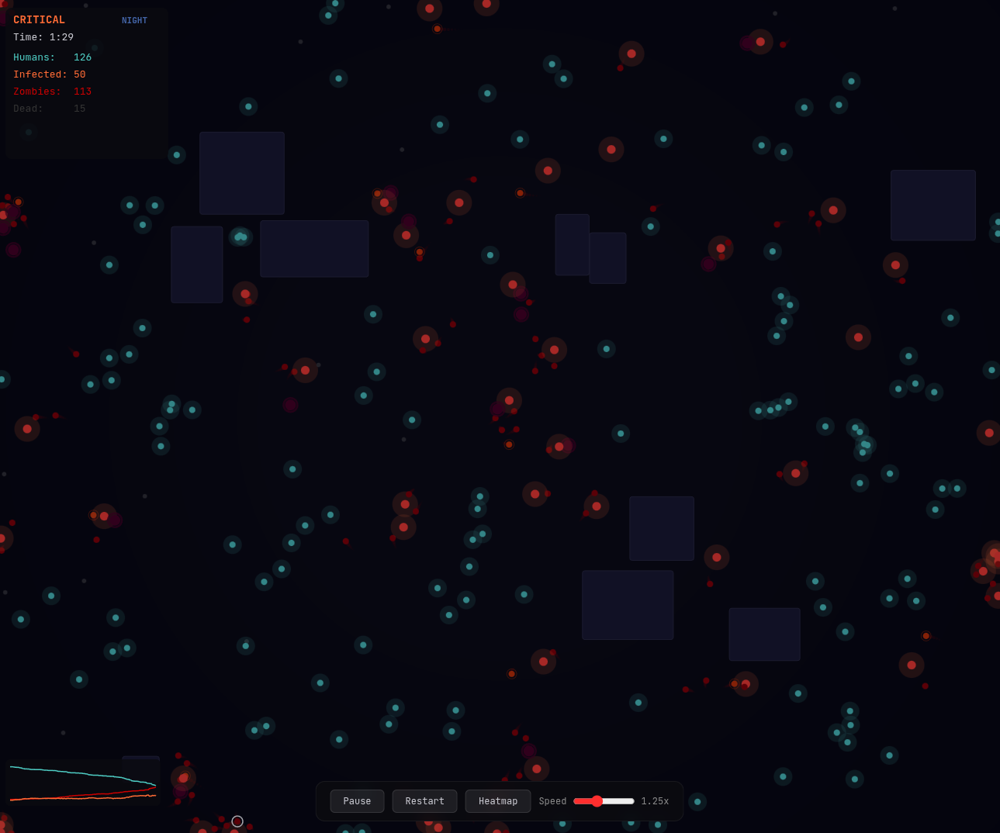

# Zombie Simulation

A 2D agent-based zombie outbreak simulation on HTML Canvas. Watch Patient Zero spark a slow infection that tips into full apocalypse as emergent hordes form, survivors flee, and buildings become death traps.

**[Live Demo](https://iloire.github.io/zombie-simulation/)**



## Run

```bash
npm install
npm run dev
```

## Controls

| Input | Action |
|---|---|
| **Click** canvas | Drop a new zombie |
| **Space** | Pause / resume |
| **H** | Toggle zombie density heatmap |
| **Speed slider** | 0.25x — 3x simulation speed |
| **Restart** | Fresh outbreak with new map |

## How it works

**300 humans** spawn across a dark map scattered with random buildings. A single **Patient Zero** shambles out from the center. Agents use weighted steering forces (flee, seek, wander, cohesion, separation) to move each frame, with a spatial grid keeping neighbor lookups fast.

When a zombie gets within bite range of a human, that human becomes **infected** — visibly pulsating orange-to-red — and after 5–15 seconds turns into one of three zombie variants:

- **Shamblers** (60%) — slow, steady, the backbone of every horde
- **Runners** (25%) — fast with a jittery outline, but burn out and die after ~10 seconds
- **Tanks** (15%) — large, slow, hard to miss

A **day/night cycle** shifts every 30 seconds. At night a blue overlay drops, zombies speed up 1.4x, and the ambient drone deepens. Buildings block movement and create chokepoints where survivors cluster — then get cornered.

The **sparkline** in the bottom-left tracks population over time. The **heatmap** overlay reveals where zombie density is highest.

## Tech

Vanilla TypeScript, HTML Canvas, Vite. No frameworks or libraries. Web Audio API for sound.
